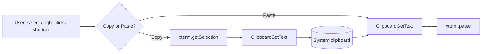

# Terminal Component Reference

**Last updated:** 2026-08-15

Architecture and implementation reference for the `Terminal` component, focused on the **copy/paste** feature (PRD-016, fixed by Fix-002) and **context menu positioning** (Fix-003 + Fix-004). For end-user instructions, see the [Terminal user guide](../user-guide/terminal.md).

---

## Table of Contents

1. [Overview](#overview)
2. [Clipboard integration](#clipboard-integration)
3. [xterm.js selection API](#xtermjs-selection-api)
4. [Copy / Paste handlers](#copy--paste-handlers)
5. [Keyboard shortcuts](#keyboard-shortcuts)
6. [Context menu](#context-menu)
7. [Context menu positioning](#context-menu-positioning)
8. [Accessibility implementation](#accessibility-implementation)
9. [Styling (Mission Control)](#styling-mission-control)
10. [Files](#files)

---

## Overview

`frontend/src/components/Terminal.tsx` is a `React.forwardRef` component that wraps an [xterm.js](https://xtermjs.org/) instance for SSH sessions. The copy/paste feature adds:

- Two async handlers (`handleCopy`, `handlePaste`) bridging xterm.js selection ↔ the system clipboard.
- A global `keydown` listener for `Ctrl`/`Cmd`+`C`/`V` (and their `Shift` variants).
- A right-click context menu (`role="menu"`) rendered as a portal-less fixed-position `<div>`.
- Full keyboard navigation and reduced-motion support for the menu.



## Clipboard integration

The feature uses the **Wails runtime clipboard API**, not a custom Go backend method. The PRD-016 plan described `App.GetClipboard()`/`App.SetClipboard()` in `backend/app.go`, but the shipped code imports the generated runtime bindings instead:

```tsx
import { ClipboardGetText, ClipboardSetText } from '../../wailsjs/runtime/runtime';
```

| Runtime function | Signature | Use |
|------------------|-----------|-----|
| `ClipboardGetText()` | `Promise<string>` | Read clipboard for paste |
| `ClipboardSetText(text)` | `Promise<boolean>` | Write selection for copy |

This is cross-platform (Wails handles the OS clipboard) and requires **no new backend code or dependencies**. Failures are caught and logged; they never crash the terminal.

```tsx
// Copy
await ClipboardSetText(selection);
// Paste
const text = await ClipboardGetText();
if (text) term.paste(text);
```

## xterm.js selection API

| Method | Purpose |
|--------|---------|
| `term.getSelection()` | Returns the currently selected text (empty string if none) |
| `term.hasSelection()` | `true` when there is an active selection |
| `term.paste(text)` | Inserts `text` at the cursor |

The terminal instance is held in `xtermRef` (a `useRef`), so handlers read the live instance without re-rendering.

## Copy / Paste handlers

Both are `useCallback` hooks that no-op safely when `xtermRef.current` is null, and always close the context menu afterward.

- **`handleCopy`** — reads `term.getSelection()`; if non-empty, writes it via `ClipboardSetText`. Errors are logged via `console.error`.
- **`handlePaste`** — reads `ClipboardGetText()`; if non-empty, calls `term.paste(text)`.

## Keyboard shortcuts

A single `window` `keydown` listener (mounted in a `useEffect`) handles shortcuts:

```tsx
if (!(e.ctrlKey || e.metaKey)) return;
const key = e.key.toLowerCase();
if (key !== 'c' && key !== 'v') return;
if (key === 'c' && !term.hasSelection()) return; // let xterm handle interrupt
e.preventDefault();
if (key === 'c') handleCopy(); else handlePaste();
```

Key behaviors:

- Accepts **`Ctrl`** (Windows/Linux) **or `Meta`** (`Cmd` on macOS).
- **`Shift` is ignored**, so `Ctrl`+`C`, `Ctrl`+`Shift`+`C`, `Ctrl`+`V`, and `Ctrl`+`Shift`+`V` all work.
- **`Ctrl`+`C` with no selection does nothing here** — it returns *before* `preventDefault`, so xterm.js still receives the key and emits the normal interrupt (SIGINT). This preserves standard terminal behavior.
- The listener is cleaned up on unmount.

## Context menu

State lives in two pieces of React state/refs:

- `contextMenu: { x: number; y: number } | null` — position (client coords) or hidden.
- `hasSelection: boolean` — gates the **Copy** button's `disabled` attribute.
- `contextMenuRef` — the menu DOM node, used for focus and outside-click detection.

**Open** — `handleContextMenu` calls `e.preventDefault()` (suppresses the native browser menu), sets `hasSelection` from `term.hasSelection()`, and stores the cursor position.

**Close** — a `useEffect` keyed on `contextMenu` adds `click` (outside the menu node) and `keydown` (`Esc`) listeners, removed on cleanup.

**Render:**

```tsx
<div role="menu" tabIndex={-1} onKeyDown={handleMenuKeyDown} style={{ left, top }}>
  <button role="menuitem" onClick={handleCopy} disabled={!hasSelection}>Copy</button>
  <button role="menuitem" onClick={handlePaste}>Paste</button>
</div>
```

## Context menu positioning

The menu is `position: fixed` and anchored at the cursor (`contextMenu.x/y` = `clientX/clientY`). A `useLayoutEffect` keyed on `contextMenu` measures the rendered menu (`getBoundingClientRect()`) and adjusts `menuPosition` **before the browser paints**, so the user never sees it flash at the clipped spot.

**Algorithm (5 steps), in order:**

1. **Right edge** — if `x + width > innerWidth - padding`, flip left: `x = cursorX - width`.
2. **Left edge** — if the flipped `x < padding`, flip back right: `x = cursorX`.
3. **Bottom edge** — if `y + height > innerHeight - padding`, flip above: `y = cursorY - height`.
4. **Top edge** — if the flipped `y < padding`, flip back below: `y = cursorY`.
5. **Final clamp** — `x = clamp(padding, x, innerWidth - width - padding)` (same for `y`), so the menu stays fully visible even when it is larger than the viewport.

`padding` is `8` px — keeps the menu off the very edge without looking detached. Steps 1–4 are directional flips; step 5 is a safety net for extreme cases (e.g. a menu taller than the window).

**Why `useLayoutEffect` and not `useEffect`:** `useEffect` runs *after* paint, so a clipped menu would render for one frame before moving — a visible flicker. `useLayoutEffect` runs *before* paint, so the corrected position is committed in the same frame. The menu is measured (not guessed) because its width/height depend on content and CSS, not just the cursor.

**Edge coverage:** all 4 corners (top-left, top-right, bottom-left, bottom-right) and all 4 edges are handled by the flip + clamp combination. The same logic lives in `FileExplorer.tsx` (Fix-003 + Fix-004), so both menus behave identically at any window size and in split view.

> **See:** `docs/planning/fix-003-context-menu-positioning.md` and `docs/planning/fix-004-context-menu-edge-refinement.md` for the full fix plans and acceptance criteria.

## Accessibility implementation

Fix-002 brought the menu to WCAG 2.1 AA. Three mechanisms:

1. **Auto-focus** — when the menu opens, a `useEffect` focuses the first non-disabled button (`querySelector('button:not(:disabled)')`), so keyboard users land inside the menu immediately.
2. **Arrow-key navigation** — `handleMenuKeyDown` handles `ArrowDown`/`ArrowUp` by computing the next index with wrap-around (`(idx + 1) % len` / `(idx - 1 + len) % len`) and calling `.focus()`. `Esc` closes; all other keys fall through.
3. **Reduced motion** — `Terminal.module.css` disables the `menuIn` animation under the `prefers-reduced-motion: reduce` media query.

ARIA: the container is `role="menu"`, items are `role="menuitem"`, and focus is managed programmatically — screen readers announce items and their disabled state correctly.

## Styling (Mission Control)

All menu styles live in `Terminal.module.css` under `.contextMenu` and reuse Mission Control design tokens (defined in `global.css` / `DESIGN-SYSTEM.md`):

| Token | Used for |
|-------|----------|
| `--bg-tertiary` | Menu background |
| `--border-default` | Menu border |
| `--radius-md` | Menu corner radius |
| `--shadow-lg` | Menu elevation |
| `--text-primary` / `--text-tertiary` | Item text / disabled text |
| `--bg-hover` | Hover background |
| `--border-focus` | `:focus-visible` outline |
| `--transition-fast` | Hover color transition |

The menu uses `min-width: 190px` to match the `FileExplorer` context menu width (aligned in Fix-002). The open animation is a `0.12s` `menuIn` keyframe (opacity + 4px slide), disabled under reduced motion.

## Files

| File | Change |
|------|--------|
| `frontend/src/components/Terminal.tsx` | Copy/paste handlers, global shortcut listener, context menu JSX, keyboard nav, auto-focus, outside-click/`Esc` close, `useLayoutEffect` viewport-boundary positioning (Fix-003 + Fix-004) |
| `frontend/src/components/Terminal.module.css` | `.contextMenu` styles (Mission Control tokens), `menuIn` animation, `prefers-reduced-motion` override |

No backend changes — clipboard I/O goes through the Wails runtime bindings (`frontend/wailsjs/runtime/runtime`).

---

**Related:** [Terminal user guide](../user-guide/terminal.md) · [PRD-016](../planning/prd-016-terminal-copy-paste.md) · [Fix-002 summary](../planning/fix-002-implementation-summary.md) · [Fix-003](../planning/fix-003-context-menu-positioning.md) · [Fix-004](../planning/fix-004-context-menu-edge-refinement.md)
