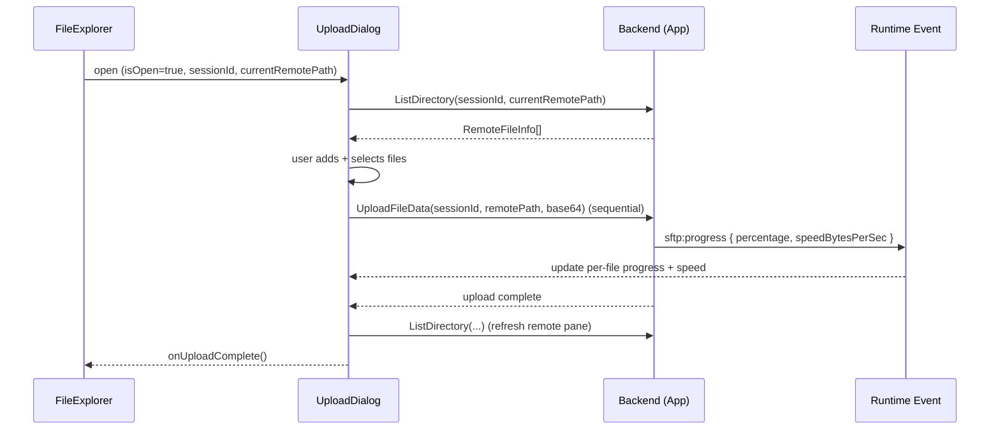

# UploadDialog Component

**Last updated:** 2026-08-15

Reference for `frontend/src/components/UploadDialog.tsx` (PRD-012). A self-contained React modal for batch-uploading local files to the current remote SFTP directory, with multi-select, per-file progress, speed tracking, and cancel controls.

---

## Table of Contents

1. [Overview](#overview)
2. [Props](#props)
3. [State Management](#state-management)
4. [Event Handling](#event-handling)
5. [Drag-and-Drop](#drag-and-drop)
6. [Integration Example](#integration-example)
7. [Styling](#styling)
8. [Accessibility](#accessibility)

---

## Overview

`UploadDialog` is a controlled modal rendered by `FileExplorer`. It owns all upload state locally — no global store, no backend changes. It reuses the existing `UploadFileData` Wails binding and the `sftp:progress` runtime event.



## Props

| Prop | Type | Required | Description |
| ---- | ---- | -------- | ----------- |
| `isOpen` | `boolean` | Yes | Controls visibility. The component returns `null` when `false`. |
| `sessionId` | `string` | Yes | Active SFTP session id, passed to backend calls and used to filter `sftp:progress` events. |
| `currentRemotePath` | `string` | Yes | Target remote directory. Files are uploaded to `<currentRemotePath>/<fileName>` (or `/<fileName>` when root). |
| `onClose` | `() => void` | Yes | Called when the dialog should close (X button, ESC with no active upload, or confirm-close). |
| `onUploadComplete` | `() => void` | Yes | Called once after a batch where at least one file completed; used by the parent to refresh its own directory listing. |

```tsx
<UploadDialog
  isOpen={uploadDialogOpen}
  sessionId={sessionId}
  currentRemotePath={currentPath}
  onClose={() => setUploadDialogOpen(false)}
  onUploadComplete={() => loadDirectory(currentPathRef.current)}
/>
```

> **Note:** The PRD named this prop `currentPath`; the implemented prop is `currentRemotePath`. Use the implemented name.

## State Management

All state is local to the component via `useState` and `useRef`.

**State (`useState`):**

| State | Type | Purpose |
| ----- | ---- | ------- |
| `localFiles` | `LocalFile[]` | The upload queue — every added file with selection + status. |
| `remoteFiles` | `RemoteFileInfo[]` | Read-only listing of the target remote directory. |
| `remoteLoading` / `remoteError` | `boolean` / `string` | Remote pane load status. |
| `uploading` | `boolean` | True while a batch is running (drives button disabled states). |
| `toast` | `{ message, type } \| null` | Transient summary notification (auto-clears after 4 s). |
| `confirmClose` | `boolean` | Shows the "uploads in progress" confirm dialog. |

**Refs (`useRef`)** — kept in refs so async loops and event handlers read live values without re-subscribing:

| Ref | Type | Purpose |
| --- | ---- | ------- |
| `fileInputRef` | `HTMLInputElement` | Programmatic trigger of the hidden file input. |
| `toastTimerRef` | `number` | Timeout handle for toast auto-dismiss. |
| `currentUploadingIdRef` | `string \| null` | Id of the file currently transferring — the `sftp:progress` handler updates only this row. |
| `cancelledRef` | `Set<string>` | Ids cancelled by the user; checked inside the upload loop. |
| `cancelAllRef` | `boolean` | Global cancel flag for the whole batch. |
| `uploadingRef` | `boolean` | Mirror of `uploading` for the ESC handler and close guard. |

**Key types:**

```ts
type UploadState = 'pending' | 'uploading' | 'completed' | 'error' | 'cancelled';

interface LocalFile {
  id: string;            // crypto.randomUUID()
  file: File;
  selected: boolean;
  uploadState: UploadState;
  progress: number;      // 0–100
  speed: string;         // formatted, e.g. "1.2 MB/s"
  error?: string;
}

interface RemoteFileInfo {
  name: string;
  size: number;
  mode: number;
  modifiedTime: number;
  isDir: boolean;
  path: string;
}
```

**Upload loop (`startUpload`):** filters selected files in `pending`/`error` state into a queue, then iterates **sequentially**. For each file it sets `uploading` state, base64-encodes the file, calls `UploadFileData`, refreshes the remote pane on success, and continues on error (recording completed/failed/cancelled counts). A final toast reports the summary.

## Drag-and-Drop

PRD-013 added HTML5 drag-and-drop: users can drag files from the OS file explorer into the **local pane** instead of using the **Add Files** button. It is a progressive enhancement — the button stays fully keyboard-accessible and both paths funnel through the same `addFiles()` helper.

**State (`useState`):**

| State | Type | Purpose |
| ----- | ---- | ------- |
| `isDragging` | `boolean` | Drives the `.dropping` class on the local pane — true while a file drag is over it. |

**Refs (`useRef`):**

| Ref | Type | Purpose |
| ----- | ---- | ------- |
| `dragCounterRef` | `number` | Drag-enter/leave counter. Incremented on `dragenter`, decremented on `dragleave`; `isDragging` clears only when it returns to `0`. Prevents the highlight from flickering as the pointer crosses nested children (each child fires its own enter/leave). |

**Event handlers** (attached to the local `<section>`):

```tsx
const handleDragEnter = (e: React.DragEvent) => {
  e.preventDefault();
  e.stopPropagation();
  dragCounterRef.current++;
  if (e.dataTransfer.types.includes('Files')) {
    setIsDragging(true);
  }
};

const handleDragLeave = (e: React.DragEvent) => {
  e.preventDefault();
  e.stopPropagation();
  dragCounterRef.current--;
  if (dragCounterRef.current === 0) {
    setIsDragging(false);
  }
};

const handleDragOver = (e: React.DragEvent) => {
  e.preventDefault();   // required so `drop` fires
  e.stopPropagation();
};

const handleDrop = (e: React.DragEvent) => {
  e.preventDefault();
  e.stopPropagation();
  setIsDragging(false);
  dragCounterRef.current = 0;

  if (uploading) {
    showToast('Cannot add files during upload', 'info');
    return;
  }

  const files = Array.from(e.dataTransfer.files);
  if (files.length > 0) {
    addFiles(files);
  }
};
```

**Key implementation details:**

- **Type detection** — `e.dataTransfer.types.includes('Files')` distinguishes OS file drags from in-app drags (e.g. remote file moves), so only real file drops activate the highlight.
- **Shared helper** — `addFiles(files: File[])` is reused by both `handleDrop` and the file-input `onChange`, keeping button and drag behavior identical. Each file gets a unique id via `crypto.randomUUID()` and `selected: true` (auto-selected).
- **Upload guard** — `handleDrop` returns early with an info toast when `uploading` is true, so the queue can't change mid-batch.
- **Counter reset** — `handleDrop` resets `dragCounterRef.current = 0` so a later drag starts clean even if a `dragleave` was missed.

**Height changes (PRD-013):** dialog `max-height` raised `88vh → 90vh`; local/remote `.fileList` `min-height` set to `320px` so more rows show without scrolling.

## Event Handling

Progress is driven by the global `sftp:progress` runtime event, not by the upload promise:

```ts
useEffect(() => {
  if (!isOpen) return;
  refreshRemote();

  const handleProgress = (data: SFTPProgressEvent) => {
    if (data.sessionId !== sessionId) return;          // ignore other sessions
    const id = currentUploadingIdRef.current;
    if (!id || cancelledRef.current.has(id)) return;   // ignore cancelled
    setLocalFiles((prev) =>
      prev.map((f) =>
        f.id === id
          ? {
              ...f,
              progress: Math.round(data.percentage || 0),
              speed: formatSpeed(data.speedBytesPerSec || 0),
            }
          : f
      )
    );
  };

  window.runtime.EventsOn('sftp:progress', handleProgress);
  return () => window.runtime.EventsOff('sftp:progress');
}, [isOpen, sessionId, currentRemotePath]);
```

`SFTPProgressEvent` shape (`frontend/src/types/events.d.ts`):

| Field | Type | Used for |
| ----- | ---- | -------- |
| `sessionId` | `string` | Filter to the active session. |
| `percentage` | `number` | Per-file progress bar width. |
| `speedBytesPerSec` | `number` | Live speed label (formatted via `formatSpeed`). |
| `remotePath` / `localPath` / `bytesTotal` / `bytesCurrent` / `operation` / `completed` | various | Available on the event; not consumed by this component. |

The listener is registered on open and removed on unmount/close to avoid leaks.

## Integration Example

`FileExplorer.tsx` owns the open flag and renders the dialog:

```tsx
const [uploadDialogOpen, setUploadDialogOpen] = useState(false);
// ...
<button
  type="button"
  className={`${styles.btn} ${styles.btnUpload}`}
  onClick={() => setUploadDialogOpen(true)}
  aria-label="Open upload dialog"
>
  <Upload size={16} aria-hidden="true" />
  Upload
</button>
// ...
{uploadDialogOpen && (
  <UploadDialog
    isOpen={uploadDialogOpen}
    sessionId={sessionId}
    currentRemotePath={currentPathRef.current}
    onClose={() => setUploadDialogOpen(false)}
    onUploadComplete={() => loadDirectory(currentPathRef.current)}
  />
)}
```

Backend bindings used (no changes required):

- `window.go.main.App.UploadFileData(sessionId, remotePath, base64Data)`
- `window.go.main.App.ListDirectory(sessionId, path)`

## Styling

Styles live in `UploadDialog.module.css` (CSS Modules, scoped). The component uses the **Mission Control** design system — deep navy surfaces, cyan (`#22d3ee`) accents, glass-morphism, and `lucide-react` icons.

Common override targets:

| Class | Element |
| ----- | ------- |
| `.overlay` | Modal backdrop (`position: fixed`, `z-index` above app). |
| `.dialog` | Dialog surface (min-width 800 px). |
| `.splitPane` | `display: grid; grid-template-columns: 1fr 1fr;` two panes. |
| `.localPane` | Local pane wrapper; carries a `0.2s ease` transition on `border-color`/`background-color` for the drag highlight. |
| `.localPane.dropping` | Active drop target — cyan border (`--accent-primary`) + faint cyan tint (`rgba(34,211,238,0.05)`). Toggled by `isDragging`. |
| `.progressTrack` / `.progressFill` | Per-file and overall progress bars. |
| `.toast` / `.toastSuccess` / `.toastError` / `.toastInfo` | Summary notifications. |
| `.spin` | Refresh-icon spin animation. |

To recolor, override the CSS custom properties from the design system (e.g. `--accent-primary`) rather than editing each rule. Respect `prefers-reduced-motion` — the existing animations already guard against it.

## Accessibility

- **Modal semantics:** `role="dialog"`, `aria-modal="true"`, `aria-label="Upload files"` on the overlay; `role="alertdialog"` on the close-confirmation.
- **Labels:** Every button and checkbox has an `aria-label` (e.g. `Cancel upload of <name>`, `Select <name>`); decorative icons are `aria-hidden`.
- **Live regions:** progress and error text use `role="status"` / `role="alert"` so screen readers announce changes.
- **Keyboard:** `Tab`/`Shift+Tab` navigation, `Space` toggles checkboxes, `Enter` activates buttons, `Esc` closes (with confirmation while uploading).
- **Focus & indeterminate state:** the Select-All checkbox reflects partial selection via the native `indeterminate` property; focus is kept within the dialog.
- **High contrast:** relies on the design system's contrast-compliant palette; no custom low-contrast overrides.

---

**Related:** [File Manager & Upload Dialog User Guide](../user-guide/file-manager.md) · [Changelog](../planning/changelog.md)
