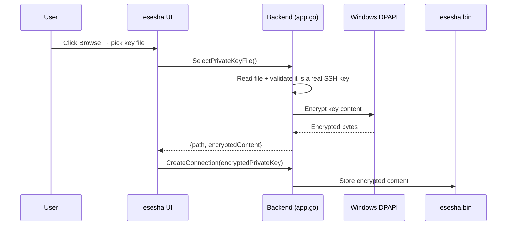

# Secure Private Key Storage

**Last updated:** 2026-08-14

How esesha keeps your SSH private keys safe — and what changed in Fix-011.

---

## Contents

- [What changed](#what-changed)
- [How it works (plain language)](#how-it-works-plain-language)
- [Benefits](#benefits)
- [Important limitation: machine-bound keys](#important-limitation-machine-bound-keys)
- [Backward compatibility](#backward-compatibility)
- [Using the PPK converter with secure storage](#using-the-ppk-converter-with-secure-storage)
- [FAQ](#faq)

---

## What changed

Before Fix-011, esesha saved only the **file path** to your private key (e.g. `C:\Users\you\.ssh\id_rsa`). The actual key file stayed on disk, and esesha read it every time it connected.

Now, when you select a private key, esesha reads the key **content**, encrypts it with Windows DPAPI, and stores the encrypted content **inside its own database** (`esesha.bin`). The original file is no longer needed after selection.

In the connection editor you will now see:

```
🔒 Private key stored securely
```

instead of a file path like `C:\Users\you\.ssh\id_rsa`.

---

## How it works (plain language)

1. You click **Browse** next to *Private Key* and pick a `.pem`, `.key`, or OpenSSH key file.
2. esesha immediately checks the file is a **valid SSH private key** (so you can't accidentally pick a wrong file).
3. esesha encrypts the key content using **Windows DPAPI** — the same Windows built-in protection used for passwords.
4. The encrypted content is saved in the connection profile.
5. When you connect, esesha decrypts the content in memory, uses it for the SSH handshake, and discards it. The key never sits as a plain-text file on disk after selection.



---

## Benefits

- **No more broken connections.** If you delete, rename, or move the original key file, the connection still works — the key content lives inside esesha's database.
- **One less thing to lose.** Your key travels with your esesha data (`esesha.bin`), not scattered across random file paths.
- **Encrypted at rest.** The key is protected by Windows DPAPI, the same mechanism that protects your saved passwords.
- **Validated on selection.** esesha rejects non-key files (`.txt`, `.jpg`, etc.) at pick time with a clear error, instead of failing cryptically at connect time.

---

## Important limitation: machine-bound keys

> ⚠️ **Encrypted keys are tied to your Windows user account on the machine where they were created.**

Because esesha uses **Windows DPAPI (CurrentUser scope)**, an encrypted key can only be decrypted by the **same Windows user on the same machine** that encrypted it.

What this means in practice:

| Scenario | Does it work? |
| -------- | ------------ |
| Same Windows user, same machine | ✅ Yes |
| Different Windows user, same machine | ❌ No — DPAPI won't decrypt |
| Same user, different machine | ❌ No — DPAPI is machine-bound |
| Backup restored on a different machine | ❌ Encrypted keys won't decrypt there |

**If you move to a new machine**, re-select the original key file (or re-run the PPK converter) on the new machine to re-encrypt it locally. Plain-text passwords in the same backup *are* portable; only the encrypted key blob is machine-bound.

---

## Backward compatibility

Fix-011 is **fully backward compatible**. No breaking changes.

- **Existing connections** that still reference a file path (`PrivateKeyPath`) continue to work exactly as before. esesha falls back to reading the file from disk.
- **Priority rule:** if a connection has *both* an encrypted key and a file path, esesha uses the **encrypted content first**, then falls back to the file path.
- You don't need to re-create old connections. They keep working; only *new* connections you create use the new secure storage by default.

---

## Using the PPK converter with secure storage

The **Tools → PPK Formatter** flow now feeds directly into secure storage:

1. Open **Tools → PPK Formatter**.
2. Select your `.ppk` source, enter the passphrase if needed, and choose a destination `.pem`.
3. Click **Convert**. esesha writes the `.pem` to disk *and* returns the **encrypted PEM content** to the connection form.
4. In the connection editor, the *Private Key* field now shows `🔒 Private key stored securely` — the converted key is already stored, no separate file browse needed.

See [PPK to PEM Converter guide](../guides/ppk-converter.md) for the full walkthrough.

---

## FAQ

**Q: Can I still use a file path instead of secure storage?**
A: Yes. Legacy connections keep their file paths and continue to work. New connections store the encrypted content, but the file-path field is still accepted for backward compatibility.

**Q: Is my key safe if someone copies `esesha.bin`?**
A: The encrypted key blob is protected by Windows DPAPI. On another machine or another Windows user it cannot be decrypted. Treat `esesha.bin` like any credential store — don't share it casually.

**Q: What happens if the encrypted data is corrupted?**
A: esesha detects empty/decryption failures and shows a clear error ("decrypted private key is empty" / "failed to decrypt private key") instead of a cryptic SSH failure.

**Q: Do I need to do anything to migrate old connections?**
A: No. Old connections work unchanged. Only new selections use the new storage.

**For developers:** see [PEM Encryption — Technical](../technical/pem-encryption.md) and the [Connection API reference](../api/connection-api.md).
