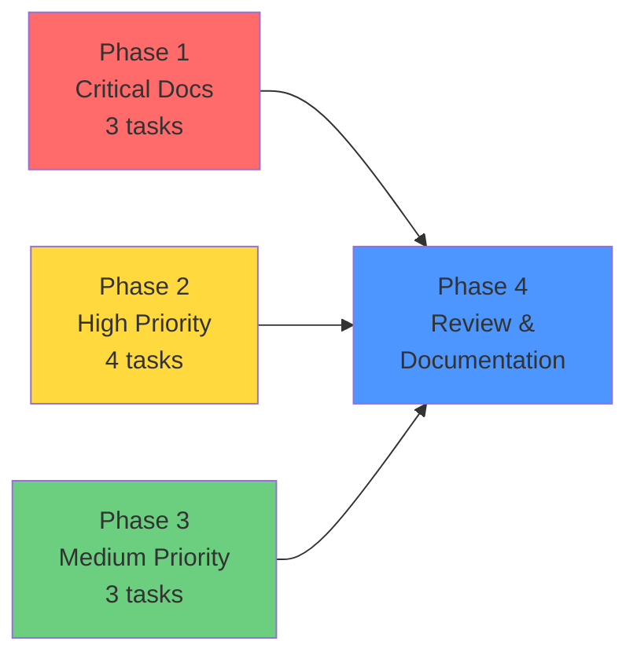

# PRD-015 Index — Start Here

**PRD:** Project Cleanup and Optimization  
**Status:** ✅ Planning Complete → Ready for Implementation  
**Created:** 2026-08-15  
**Priority:** MAJOR (10 Explorer audit issues)

---

## Quick Navigation

### 📋 For Orchestrator
→ **[prd-015-orchestrator-guide.md](prd-015-orchestrator-guide.md)**  
Agent routing, parallelization strategy, task assignments

### 👨‍💻 For Implementing Agents
→ **[prd-015-checklist.md](prd-015-checklist.md)**  
Simple checkbox list with code snippets, grouped by priority

### 📚 For Complete Specification
→ **[prd-015-project-cleanup-optimization.md](prd-015-project-cleanup-optimization.md)**  
Full PRD: problem statement, technical design, risks, rollback

### 📊 For Progress Tracking
→ **[prd-015-implementation-summary.md](prd-015-implementation-summary.md)**  
Phase-by-phase breakdown, agent assignments, acceptance criteria

### ✅ For Final Verification
→ **[prd-015-planning-complete.md](prd-015-planning-complete.md)**  
Planning summary, decisions made, success criteria

---

## Document Purpose Matrix

| Document | Audience | Purpose | When to Use |
|----------|----------|---------|-------------|
| **ORCHESTRATOR-GUIDE** | Orchestrator | Agent routing & parallelization | Before dispatching tasks |
| **CHECKLIST** | Documentation + Backend Dev | Quick reference during implementation | While implementing |
| **prd-015-project-cleanup** | All | Complete specification | For full context & decisions |
| **IMPLEMENTATION-SUMMARY** | Orchestrator + Agents | Task breakdown & tracking | During execution & review |
| **PLANNING-COMPLETE** | Team | Planning summary & rationale | After planning, before implementation |
| **This file (INDEX)** | Everyone | Navigation hub | Starting point |

---

## The 10 Issues Being Fixed

### 🔴 Critical (Must Fix First)
1. **frontend/README.md** — Svelte template content (project is React)
2. **frontend/src/vite-env.d.ts** — Svelte type references (should be React only)
3. **docs/DESIGN-SYSTEM.md** — Wrong color palette (docs ≠ code)

### 🟡 High Priority
4. **wails.json** — Missing explicit frontend paths
5. **build.bat** — Missing `setlocal enabledelayedexpansion`
6. **.gitignore** — Missing build artifact patterns
7. **docs/planning/** — No archive for superseded PRDs

### 🟢 Medium Priority
8. **app.go** — EditFile() not marked deprecated
9. **PRD naming** — Inconsistent uppercase/lowercase
10. **package.json.md5** — Unclear purpose

---

## Implementation Phases



**Phase 1-3:** Parallel execution (10 tasks, 2 agents)  
**Phase 4:** Sequential verification (1 agent)

**Total time:** ~2.5-3.5 hours

---

## Agent Assignments

### Documentation Agent (6 tasks)
- Phase 1: Tasks 1.1, 1.2, 1.3 (critical doc fixes)
- Phase 2: Task 2.4 (archive structure)
- Phase 3: Tasks 3.2 (PRD renaming + changelog updates)
- Phase 4: Tasks 4.4, 4.5 (final documentation)

### Backend Developer (5 tasks)
- Phase 2: Tasks 2.1, 2.2, 2.3 (config fixes)
- Phase 3: Tasks 3.1, 3.3 (deprecation comment + md5 investigation)

### Debugger/Reviewer (1 phase)
- Phase 4: Tasks 4.1, 4.2, 4.3 (verification)

---

## Files Modified (10 total)

| File | Change | Priority | Agent |
|------|--------|----------|-------|
| `frontend/README.md` | Replace Svelte docs → React + Wails | 🔴 Critical | Documentation |
| `frontend/src/vite-env.d.ts` | Remove Svelte types | 🔴 Critical | Documentation |
| `docs/DESIGN-SYSTEM.md` | Sync colors to global.css | 🔴 Critical | Documentation |
| `wails.json` | Add frontendDir, wailsjsdir | 🟡 High | Backend Dev |
| `build.bat` | Add setlocal enabledelayedexpansion | 🟡 High | Backend Dev |
| `.gitignore` | Add *.bak, *.md5, build/, dist/ | 🟡 High | Backend Dev |
| `docs/planning/archive/` | Create + move 5 files | 🟡 High | Documentation |
| `app.go` | Add deprecation comment | 🟢 Medium | Backend Dev |
| `docs/planning/PRD-*.md` | Rename to lowercase | 🟢 Medium | Documentation |
| `frontend/package.json.md5` | Document or gitignore | 🟢 Medium | Backend Dev |

---

## Acceptance Criteria (12 total)

### Critical ✅
- [ ] `frontend/README.md` has React + Vite docs (no Svelte)
- [ ] `vite-env.d.ts` has no Svelte type references
- [ ] `DESIGN-SYSTEM.md` colors match `global.css` exactly

### High Priority ✅
- [ ] `wails.json` includes `frontendDir`, `wailsjsdir`
- [ ] `build.bat` has `setlocal enabledelayedexpansion`
- [ ] `.gitignore` includes `*.bak`, `*.md5`, `build/`, `frontend/dist/`
- [ ] `docs/planning/archive/` exists with 5 moved files

### Medium Priority ✅
- [ ] `app.go` EditFile() has deprecation comment
- [ ] All PRD files use lowercase naming
- [ ] `package.json.md5` documented or in gitignore

### Verification ✅
- [ ] `wails build` succeeds without warnings
- [ ] `git status` shows no untracked artifacts after build

---

## Key Decisions Made

### 1. Full PRD vs Changelog Entry
**Decision:** Full PRD  
**Reason:** 10 files, 2 agents, critical impacts, phased verification needed

### 2. Archive Structure
**Decision:** Create `docs/planning/archive/` with README  
**Reason:** Preserve history, improve discoverability, document supersession

### 3. Preserve Deprecated Code
**Decision:** Keep `internal/editor/`, `poc/ppk-pure-go/`  
**Reason:** API compatibility, research artifacts, no breakage

### 4. Parallelization Strategy
**Decision:** Phase 1-3 parallel, Phase 4 sequential  
**Reason:** No file conflicts, maximize efficiency (2.5h vs 6h)

---

## Critical Warnings ⚠️

### For Task 1.3 (Design System Sync)
The DESIGN-SYSTEM.md currently documents the **WRONG** palette:
- Docs say: `#0a0e1a` space-navy + `#22d3ee` cyan
- Code has: `#0f172a` slate-900 + `#3b82f6` blue-500

**Source of truth:** `frontend/src/styles/global.css` lines 28-67

### For Task 2.1 (wails.json)
Must validate JSON syntax after edit — broken JSON = broken build

### For Task 3.3 (package.json.md5)
Must investigate before deciding (Wails-generated vs manual)

---

## Success Metrics

✅ **All 12 acceptance criteria pass**  
✅ **`wails build` exits 0, no warnings**  
✅ **`git status` clean after build**  
✅ **All doc cross-references resolve**  
✅ **Zero functional regressions**

---

## Planning Documents Created (7 files)

```
docs/planning/
├── prd-015-project-cleanup-optimization.md     (Full PRD, 267 lines)
├── prd-015-implementation-summary.md           (Task breakdown, 180 lines)
├── prd-015-checklist.md                        (Quick ref, 115 lines)
├── prd-015-orchestrator-guide.md               (Agent routing, 235 lines)
├── prd-015-planning-complete.md                (Summary, 200 lines)
├── prd-015-index.md                            (This file, 130 lines)
└── changelog.md                                (Updated with PRD-015 entry)

docs/planning/archive/
└── README.md                                   (Archive docs, 65 lines)
```

**Total:** 8 files, 1,192 lines of planning documentation

---

## Next Action for Orchestrator

```
1. Read: prd-015-orchestrator-guide.md
2. Dispatch: Phase 1-3 tasks (parallel to 2 agents)
3. Wait: For completion signals
4. Dispatch: Phase 4 tasks (sequential)
5. Verify: All 12 acceptance criteria
6. Mark complete: Update changelog
```

---

**Planning Status:** ✅ COMPLETE  
**Implementation Status:** ⏳ READY TO START  
**Estimated Time:** 2.5-3.5 hours  
**Risk Level:** Low (no functional changes)  
**Impact:** High (docs trust, build reliability, dev experience)

---

*Created by Planner Agent on 2026-08-15*  
*Explorer audit score: 89% → Target: 98%+*
